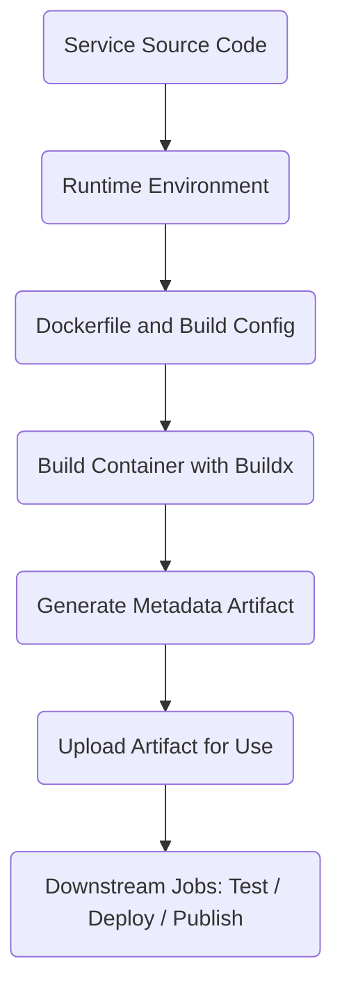
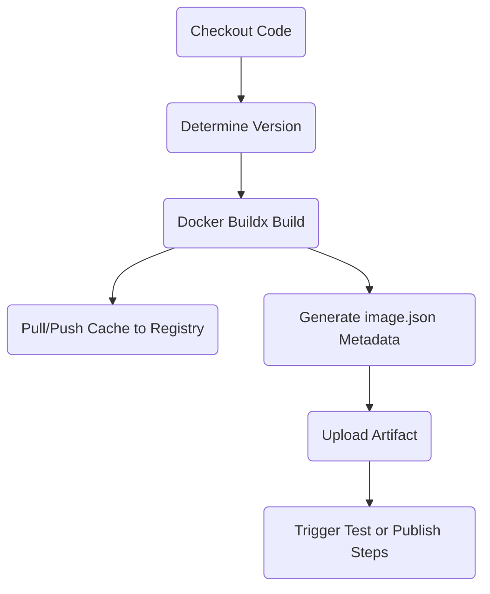
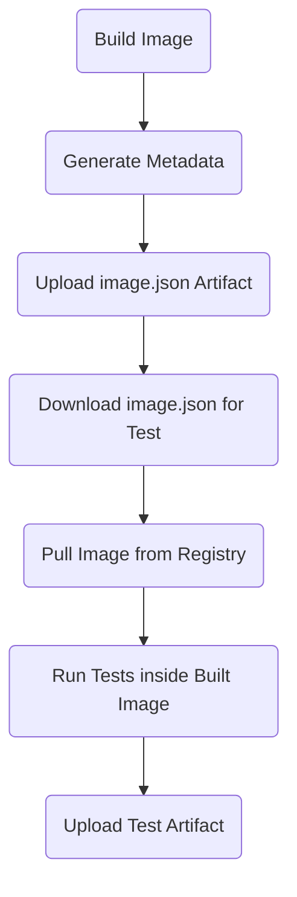

# 🏭 Microservice Architecture: Build, Test, and Deploy System

This repository defines a standardized architecture for building, testing, and publishing containerized microservices and libraries.  
It supports multiple service types, with a focus on efficiency, reproducibility, and multi-environment compatibility.

---

## 🚀 Multi-Service Support

This system supports a variety of service types:

| Service Type         | Build Environment |
|----------------------|-------------------|
| **Python Library**    | Python-based container |
| **Next.js Frontend**  | Node.js container with install/build environment |
| **TypeScript Library**| Node.js container for dependency installation and testing |

Each service type uses a specialized Docker environment optimized for caching, testing, and packaging.

---

## 🏗️ System Architecture Overview

All services follow a standardized flow:



✅ Services define their runtime and dependencies via config files (`pyproject.toml`, `package.json`, etc.).
✅ Dockerfiles create standardized containers.
✅ Build metadata (`image.json`) is generated and uploaded.
✅ Test, deploy, and publish workflows consume the metadata.

---

## 🔨 Build Process

The build workflow uses Docker Buildx with full registry cache support:



### Key Build Features
- **Dynamic Versioning:** Project version determined at build time (`make version`).
- **Registry-based Caching:** Cache pulled before build (`--cache-from`) and pushed after (`--cache-to`).
- **Multi-architecture Support:** Build for multiple platforms if needed (`amd64`, `arm64`).
- **Metadata Artifact Upload:** A standard `image.json` is generated and uploaded describing the built image.

---

## 📝 Build Metadata Artifacts

Each build creates a **metadata artifact** (default `image.json`) that describes the Docker image that was built.  
This artifact acts as a manifest for testing, publishing, and deploying.

The **language-specific metadata action** is responsible for generating the `image.json`:

- For Python services: use [`python-image-metadata`](#) action.
- For Node.js services (e.g., Next.js, TypeScript): use [`nodejs-image-metadata`](#) action.

Each metadata action must:
- **Read project metadata** from the service’s configuration file (e.g., `pyproject.toml`, `package.json`).
- **Extract** required fields such as `description`, `version`, and image references.
- **Generate** a standardized `image.json`.
- **Upload** the artifact for use by downstream workflows.

✅ All service types must follow this structure.

### 📄 Required Fields in `image.json`

| Field         | Description |
|---------------|-------------|
| `registry`    | Container registry (e.g., `ghcr.io`) |
| `repository`  | Image repository path |
| `tag`         | Image tag (e.g., `0.1.0`) |
| `image`       | Full registry image path |
| `url`         | Full URL including tag |
| `source`      | Source GitHub repository URL |
| `description` | Project description from config |
| `version`     | Canonical version (same as `tag`) |

✅ These fields must be consistently populated across all metadata artifacts.

### 🛠 How Metadata is Extracted

| Service Type          | Project File         | Metadata Source |
|------------------------|----------------------|-----------------|
| Python service         | `pyproject.toml`      | `[tool.poetry] description`, dynamic version from Git |
| Next.js frontend       | `package.json`        | `description`, `version` |
| TypeScript library     | `package.json`        | `description`, `version` |

---

## 🧪 Build and Test Workflow

Tests are executed against the built image using the metadata artifact:



### Test Runner Example

```bash
artifact=$(cat backend-image.json)
url=$(jq -r .url <<< "$artifact")

docker run --rm   -v $PWD:/app   "$url"   pytest --json-report --json-report-file=pytest.json
```

✅ Tests are always run inside the **exact image** that will be deployed.

---

## 🛠 Building Multiple Images

Services may choose to build **multiple images** within a single workflow.  
For example: a **production** image and a **development** image.

### Multiple Image Pattern
- Build multiple images with different Docker targets or arguments.
- Create a separate metadata artifact for each image.
- Name each artifact distinctly (`backend-prod-image.json`, `backend-dev-image.json`).
- Test and deploy each image independently.

### Example Use Case

| Image Type           | Purpose             | Tag Example |
|----------------------|----------------------|-------------|
| Production Image     | Optimized for deployment | `0.1.0` |
| Development Image    | Includes debugging tools, hot reload support | `0.1.0-dev` |

✅ This approach cleanly supports complex services with multiple runtime profiles.

---

## 📚 Reference Library Architecture Style

The reference library (`python-service-actions`) defines a reusable pattern for language-specific service builds:

| Component        | Purpose |
|------------------|---------|
| **Reusable Actions** | Self-contained GitHub Actions performing specific steps (e.g., build, metadata, test). |
| **Reference Workflow** | A standard GitHub workflow that orchestrates the actions into a full build/test/publish lifecycle. |

### Key Design Traits
- **Reusable Composite Actions**:
  - Language-specific, focused, and modular.
- **Standardized Artifact Output**:
  - Always produce a standardized `image.json`.
- **Workflow Composition**:
  - Top-level workflows use the actions with minimal boilerplate.

### 📦 Example Directory Structure

```plaintext
.github/
  actions/
    build-image/
    generate-metadata/
    run-tests/
  workflows/
    ci.yml
Dockerfile
Makefile
README.md
```

---

# ✅ Summary

- Supports **Python**, **Next.js**, and **TypeScript** services.
- Fully **reproducible builds** with Docker BuildKit and registry caching.
- **Artifact-driven workflows** for test, publish, and deploy.
- **Multi-image builds** supported with separate artifacts.
- **Extensible** for new service types by creating new language-specific metadata actions.

---

# 📜 License

MIT License.  
Open for contributions and extensions.

---

# 📣 Future Extensions

Adding additional service types (e.g., Go, Rust) simply requires defining new language-specific metadata actions while maintaining the `image.json` output standard.
